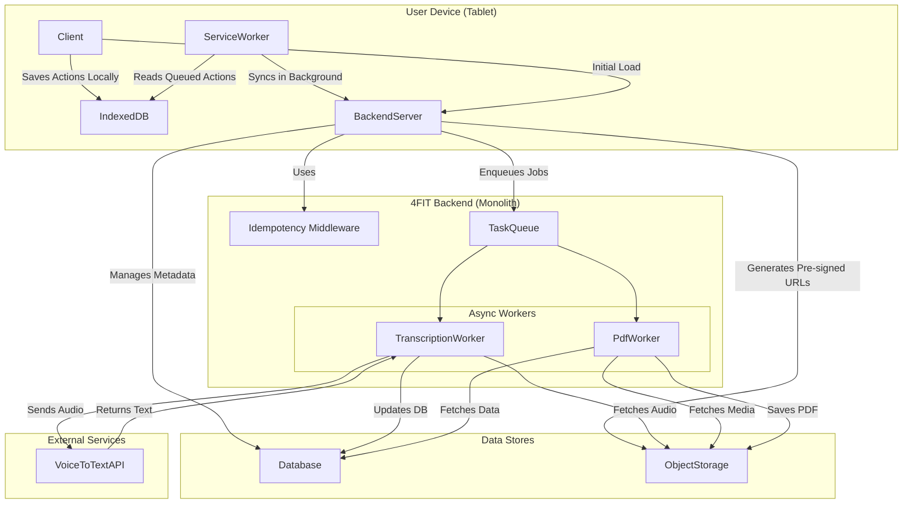
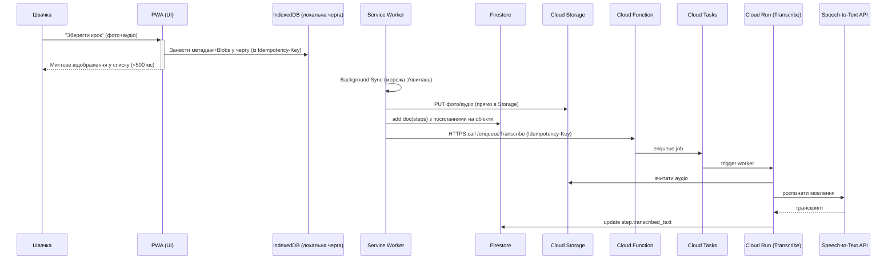
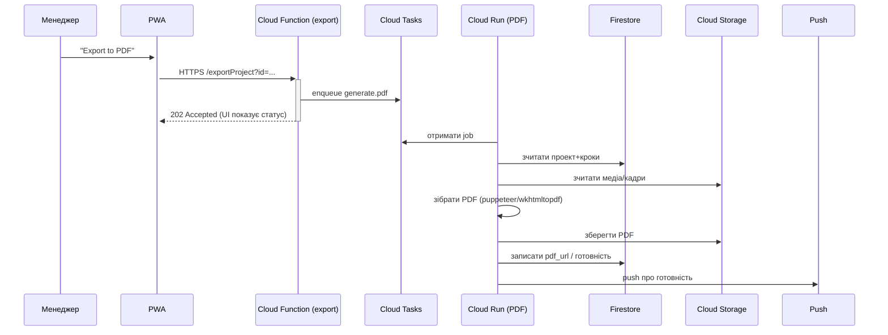
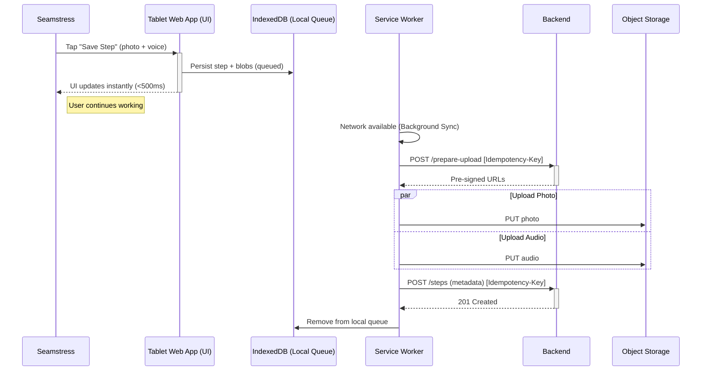
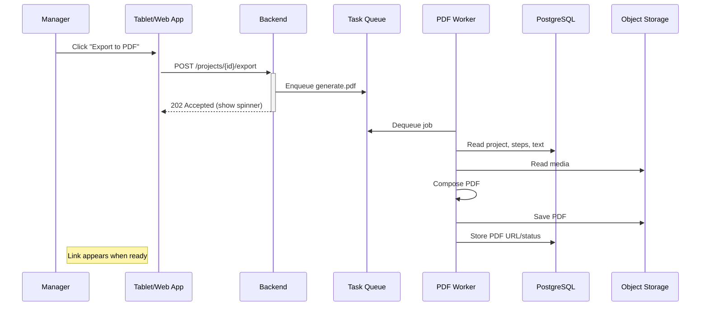

# TechStyle Ideathon + Hackathon


**Швидкі посилання**

  * 🎬 **презентація + демо відео (Firebase → 4FIT):** [Canva](https://www.canva.com/design/DAGzhFBxsMU/DAsafw5WQSYwlW7kWF9g9g/view?utm_content=DAGzhFBxsMU&utm_campaign=designshare&utm_medium=link2&utm_source=uniquelinks&utlId=hac14b754dd);
  * 🏅 **відзнака:** 2-ге місце на **TechStyle Ideathon** (13 вересня 2025, iHUB, Хмельницький)

Простий веб-інструмент для **цифрових робочих інструкцій** під час відшиву зразка: кроки з фото/відео/аудіо (з авто-транскрипцією) + короткий текст, коментарі та **одним кліком – PDF**. Цей документ описує цільову архітектуру та практичний дизайн системи, заснований на розмовах з майстрами та технічним цехом.

## 1\. Проблема та рішення

### 1.1. Суть проблеми

В експериментальному цеху під час відшиву першого зразка всі інструкції (так званий **технічний пакет**) передаються у вигляді одного друкованого аркуша. Його якість часто недостатня: неповні кроки, нечіткі вказівки, застарілі фото. У результаті «перша швачка», якій випало шити зразок, вимушена імпровізувати, покладаючись на досвід і уривчасті підказки з паперу.

Після повернення зразка на доопрацювання технологи іноді надсилають відео-пояснення, що саме зроблено не так. Зразок перешивають, затверджують, але **навіть після затвердження** інші швачки звертаються не до офіційної документації, а **до тієї самої першої швачки** за усними поясненнями. Знання «осідають» у голові однієї людини та **не перетворюються на спільну базу**.

### 1.2. Наслідки

  * затримки та переробки (rework), збільшення собівартості;
  * розрив між «як воно зроблено насправді» та тим, що зафіксовано на папері;
  * залежність від окремих людей («bus factor»), відсутність відтворюваності;
  * навантаження на технологів і канал комунікацій (месенджери, дзвінки).

### 1.3. Цілі системи

  * перетворити знання першої швачки у **структуровану, відтворювану інструкцію**;
  * зробити фіксацію кроків **настільки швидкою**, щоб вона не гальмувала роботу;
  * забезпечити **спільний доступ** для уточнень і запитань;
  * надати **друкований PDF** для робочих місць, де папір доречний.

### 1.4. Концепція рішення («живе документування»)

Під час відшиву в експериментальному цеху кроки **фіксуються на льоту** зі смартфона: фото, коротке відео, голосова нотатка з **автоматичною транскрипцією** у текст, кілька рядків коментаря. Із цього автоматично формується **покрокова інструкція онлайн** і **PDF**. Передбачені коментарі й версії, щоб цех міг швидко уточнити спірні місця.

### 1.5. Принципи дизайну

  * **Свобода та простота**: інструмент не змушує документувати зайве; команда сама визначає потрібну деталізацію залежно від складності замовлення;
  * **Мобільний пріоритет**: основний пристрій – смартфон із камерою та мікрофоном; інтерфейс оптимізовано для однієї руки та великих торкань;
  * **Швидкість понад усе**: медіа вантажаться у фоні, UI не блокується.

### 1.6. Чому не PLM/ERP

Дорослі PLM/ERP-системи (Techpacker, Centric PLM, ApparelMagic) та платформи Digital Work Instructions (Tulip, Dozuki, VKS, SwipeGuide) надмірні за складністю та вартістю впровадження. Для нашого кейсу ефективніше створити **легкий уніфікований інструмент** саме під відшив зразка – без зайвих модулів і процесів.

## 2\. Цільова аудиторія

  * **Технолог/редактор**: створює/редагує проект та кроки, затверджує.
  * **Швачка/оператор**: швидко додає кроки на планшеті, переглядає, коментує.

-----

## 3\. MVP: функціональні вимоги

### 3.1. Управління проєктами

  * створення/редагування **проєкту відшиву** (назва, код, сезон, артикул);
  * статусна модель: *In Progress* → *Needs Review* → *Approved* (керує технолог/менеджер);
  * журнали подій (хто і коли змінив статус, додав/видалив крок, згенерував PDF).

### 3.2. Захоплення кроків (основна петля)

  * **Фото / відео** зі смартфона (відео коротке; обмеження за замовчанням 10–30 с);
  * **Голосова нотатка** з автоматичною **транскрипцією** у текст;
  * **Короткий текстовий коментар**; базове форматування (рядок/абзац);
  * можливість **кількох медіа** на один крок (напр., фото + голос);
  * **порядок кроків**: додавання в кінець; вставка між кроками; швидке переміщення;
  * **версії кроку**: перегляд попередніх редакцій тексту/транскрипту;
  * позначки «важливо/ризик» для акцентування критичних етапів.

### 3.3. Перегляд та навігація

  * вертикальний **покроковий перегляд** (медіа + текст/транскрипт + коментарі);
  * швидкі фільтри: лише кроки з відео / лише помічені як «ризик» / непрочитані коментарі;
  * пошук у межах проєкту: за текстом, автором, типом медіа.

### 3.4. Комунікації та погодження

  * **коментарі на кроках** (текст; можливі @згадки користувачів);
  * позначення «потребує уточнення» / «уточнено»;
  * сповіщення (push/email) про відповіді та про готовність PDF.

### 3.5. Експорт і друк

  * **експорт у PDF** одним натисканням; автоматичні мініатюри кадрів із відео;
  * параметри експорту: включати/не включати коментарі; компактний/детальний режим; локалізований заголовок і реквізити проєкту.

### 3.6. Контроль доступу

  * ролі: **редактор (технолог)**, **коментатор (виробництво)**, **читач**;
  * видимість коментарів: «для всіх» або «лише технічному цеху»;
  * приватні медіа-об’єкти зі зчитуванням лише за авторизованими правилами.

### 3.7. Мобільний клієнт

  * **mobile-first PWA**: робота зі смартфона, підтримка офлайн-режиму;
  * **пряма зйомка** з камери, стискання фото на клієнті (WebP/AVIF), індикатори прогресу фонового завантаження;
  * зручні жести/великі елементи керування; енергоощадний режим під час довгих завантажень.

### 3.8. Адміністрування

  * перегляд логів/метрик (кількість кроків, обсяг медіа, час до PDF);
  * довідники/теги (тканина, модель, розмір) для подальшого фільтрування; опційно.

-----

## 4\. Нефункціональні вимоги

### 4.1. Продуктивність та UX-бюджети (смартфон)

  * **Відгук UI на збереження кроку:** \< **500 мс** (операції з медіа – у фоні).
  * **Час відкриття проєкту:** \< **2 с** для 30–60 кроків (кеш + ліниве завантаження медіа).
  * **Генерація PDF:** асинхронно; ціль **≤ 60 с** для 100 сторінок із мініатюрами.

### 4.2. Мережа та офлайн

  * повноцінний **offline-first**: кеш shell, IndexedDB для черги дій і Blobs; Background Sync із експоненційною затримкою (із jitter);
  * **прямі завантаження** у сховище (pre-signed URL) з відновленням після обриву;
  * політика на мобільних даних: можливість відкласти відео до Wi-Fi.

### 4.3. Зберігання та розрахунки обсягу

**Припущення (середнє проєкту):** 40 кроків; 70% кроків – фото (0.8 МБ після стиснення), 20% – коротке відео (10–20 с, 5 МБ середнє), 50% – голос (15 с, \~0.1 МБ із Opus 48 кбіт/с). Додатково: ескізи/мініатюри \~+20%.

**Розрахунок:**

  * фото: 28 × 0.8 ≈ **22.4 МБ**
  * відео: 8 × 5.0 ≈ **40.0 МБ**
  * голос: 20 × 0.1 ≈ **2.0 МБ**
  * ескізи/службові ≈ **\~12.9 МБ**
  * **Разом на проєкт:** ≈ **77–85 МБ**

**За рік:** 1 000 проєктів → **\~80–85 ГБ/рік**. **За 5 років:** **\~400–450 ГБ** (без урахування життєвого циклу/архівування).

### 4.4. Доступність і надійність

  * **Availability**: \~99.9% (внутрішній інструмент; планові вікна – вночі/вихідні);
  * **Durability**: об’єктне сховище з версіонуванням і політиками життєвого циклу;
  * кешування списків у клієнті + умовне кешування відповідей API (короткий TTL).

### 4.5. Безпека та приватність

  * доступ лише автентифікованим; принцип найменших привілеїв;
  * приватні бакети/об’єкти; підписані URL із коротким TTL; валідація доступу на бекенді;
  * гігієна транскриптів (видалення персональних даних перед експортом);
  * резервні копії метаданих; аудит змін у кроках/статусах.

-----

## 5\. Архітектура (огляд)

**Принцип:** моноліт-на-фронті з керованими сервісами Firebase/GCP. **Жодного важкого бекенду** – логіка в **Cloud Functions/Run**, дані у **Firestore**, медіа у **Cloud Storage**. Повна підтримка offline-first (PWA).

**Сервіси**

  * **Client (PWA, React/TS)**: офлайн-кеш, IndexedDB для черги дій, Background Sync.
  * **Firebase Auth**: вхід за email/password або SSO; *custom claims* для ролей.
  * **Firestore**: проєкти, кроки, коментарі, статуси, журнали операцій.
  * **Cloud Storage**: фото/відео/аудіо + PDF; правила доступу на рівні bucket.
  * **Cloud Functions / Cloud Run**: HTTPS/trigger-функції для транскрипції та PDF.
  * **Cloud Tasks / Pub/Sub**: черги для довгих/повторюваних задач.
  * **FCM**: пуш-нотіфікації (готовність PDF / коментарі).
  * **Analytics (GA4/Firebase Analytics)**: мінімальна телеметрія UI.

<!-- end list -->



-----

## 6\. Ключові потоки (Mermaid)

### 6.1. Захоплення кроку (offline-first)



### 6.2. Експорт у PDF (асинхронно)



-----

## 7\. Модель даних (Firestore)

**Колекції та документи**

```
/projects/{projectId}
  name: string
  status: 'In Progress' | 'Needs Review' | 'Approved'
  created_at, updated_at: timestamp
  approved_at?: timestamp
  last_pdf?: { url: string, generated_at: timestamp }

/projects/{projectId}/steps/{stepId}
  position: number    // 1000, 2000, ... (gap-indexing для вставок між)
  text_content?: string
  transcribed_text?: string
  media: [
    { type: 'photo'|'video'|'voice', storage_path: string, thumb_path?: string }
  ]
  created_at, updated_at: timestamp

/projects/{projectId}/steps/{stepId}/comments/{commentId}
  author_uid: string
  text: string
  created_at: timestamp
```

**Індекси**

  * `projects: status ASC, updated_at DESC`
  * `steps: projectId + position ASC`
  * `comments: stepId + created_at ASC`

**Права доступу (нарис)**

  * Ролі через **custom claims** (`role: 'editor'|'commenter'`).
  * Firestore Rules: редактор → R/W проектів і кроків; коментатор → R проектів, R/W коментарів.
  * Storage Rules: запис лише автентифікованим; читання – обмежене записами Firestore (перевірка власності та доступу).

-----

## 8\. API / Cloud Functions

  * `POST /enqueueTranscribe` – додає задачу на транскрипцію аудіо (тіло: `{ projectId, stepId, storage_path, idem_key }`). **Ідемпотентність**: запис у колекцію `/idem/{key}` з TTL; повтори повертають попередню відповідь.
  * `POST /exportProject` – ставить задачу генерації PDF (тіло: `{ projectId }`). Статус відслідковується у `/projects/{id}.last_pdf`.
  * Вебхуки/тригери Firestore (за потреби): нормалізація даних, обчислювані поля.

-----

## 9\. Offline-first та ідемпотентність

  * **PWA + Service Worker**: кеш shell, **IndexedDB** для черги дій та Blobs.
  * **Background Sync**: надійні повтори з експоненційною затримкою (jitter).
  * **Firestore offline**: вбудований кеш клієнтського SDK → миттєві списки.
  * **Ідемпотентність**: клієнт генерує **Idempotency-Key (UUID)** для кожної мутації; Cloud Function зберігає/перевикористовує результат.

-----

## 10\. PDF-експорт

  * Рендер із шаблону (print-CSS) через **puppeteer/wkhtmltopdf** на Cloud Run.
  * Збереження у Storage; посилання/дата у `projects.last_pdf`.
  * UX: тост «Генеруємо…» → по готовності FCM або авто-пулінг.

-----

## 11\. Оцінки та розмір (5 років)

  * \~1 000 проектів/рік × \~87.5 МБ медіа ≈ **\~440 ГБ** загалом.
  * 50–100 користувачів одночасно; \<1 QPS середньо; Firebase достатньо.

-----

## 12\. Безпека і приватність

  * Доступ лише автентифікованим користувачам; мінімальні привілеї.
  * Приватні бакети; підписані URL (за потреби) із коротким TTL.
  * Мінімізація персональних даних у транскриптах; можливість редагування перед експортом.
  * Бекапи Firestore; версіонування Storage + lifecycle-політики.

-----

## 13\. Розгортання

  * **Firebase Hosting** для PWA; **Functions** для легких HTTPS/тригерів.
  * **Cloud Run** для важких робіт (PDF/STT-оркестрація).
  * Оточення: `.env` з ключами STT; перемикач провайдерів.
  * Спостережуваність: логи, метрики черг, помилки Storage/Functions.

-----

## 14\. Статус

Це – **цільовий системний дизайн**. Демка у цьому репозиторії була зроблена за 4 дні, тому може не покривати всі компоненти. Пул-реквести – у межах цього дизайну: **простота, PWA-first, Firebase-орієнтовано, асинхронні довгі задачі.**

-----

## Problem & users

**Core problem**

  * A master seamstress holds critical tacit knowledge; paper instructions are poor.
  * We need a **live logbook** to capture **photos/video + short voice note (auto-transcribed) + optional text** per step, then produce clean browsable instructions and a **one-tap PDF**.

**Primary user**: *First Seamstress*

  * Works fast; hands often busy; uses a shared workshop tablet; non-technical.

**Secondary users**: *Other seamstresses + Manager*

  * Must quickly find a project, follow steps, comment, and set simple status.

-----

## MVP scope & requirements

### Functional (MVP)

1.  **Project creation**: manager names a project (e.g., `FW25-Jacket-003`).
2.  **Step capture (core loop)** within a project:
      * Big button → **Photo or short video** (≤30s) from tablet camera.
      * Mic icon → **Voice note** → auto-transcribed to text.
      * Optional short **typed comment**.
3.  **Instruction view**: clean, vertical, step-by-step list showing media + text.
4.  **PDF export**: single button produces printable PDF of the whole project.
5.  **Simple collaboration**:
      * Per-step **comments**.
      * Project **status**: *In Progress* → *Needs Review* → *Approved* (manager-set).

### Out of scope (for MVP)

  * External sharing / public links
  * Full role/permission matrix (simple auth is fine)
  * Advanced search and analytics

-----

## Non-functional goals

  * **Usability first**: touch-optimised for tablets; large hit-targets; minimal taps.
  * **Responsiveness**: UI stays \< **500ms** after capture action (uploads async).
  * **Viewing**: project loads \< **2s** for typical projects.
  * **PDF**: async; ready in under a minute is acceptable.
  * **Availability**: \~**99.9%** (internal tool, off-hours maintenance is fine).
  * **Durability**: media and PDFs in object storage (\~**11 nines** provider).
  * **Scale**: \~50–100 concurrent users; \~1 QPS average.

-----

## High-level architecture

**Design stance**: a **well-structured monolith** → fastest to build, lowest ops cost. Media in object storage; metadata in Postgres; async workers for slow tasks.

**Stack suggestion**

  * **Client**: React (TypeScript) as a **PWA** (offline-first), runs on workshop tablets.
  * **Server**: Python **FastAPI** (or Flask) monolith exposing REST APIs.
  * **DB**: Managed **PostgreSQL** (metadata: projects, steps, comments).
  * **Object storage**: S3-compatible (AWS S3, DO Spaces, or MinIO for local).
  * **Queue/Workers**: Redis + **Celery** for transcription & PDF jobs.
  * **Transcription**: AWS Transcribe / Google STT / AssemblyAI (pluggable).

<!-- end list -->


-----

## Core flows (Mermaid)

### 1\) Capturing a step (offline-first, idempotent)



### 2\) Export to PDF (async)



-----

## Data model

Relational, simple, and explicit.

```sql
-- Projects
CREATE TABLE sewing_projects (
  id UUID PRIMARY KEY DEFAULT gen_random_uuid(),
  name TEXT NOT NULL UNIQUE,
  status TEXT NOT NULL DEFAULT 'In Progress', -- In Progress | Needs Review | Approved
  created_at TIMESTAMPTZ NOT NULL DEFAULT NOW(),
  updated_at TIMESTAMPTZ NOT NULL DEFAULT NOW()
);

-- Steps (ordered with gapped positions for robust reordering)
CREATE TABLE steps (
  id UUID PRIMARY KEY DEFAULT gen_random_uuid(),
  project_id UUID NOT NULL REFERENCES sewing_projects(id) ON DELETE CASCADE,
  position BIGINT NOT NULL, -- 1000, 2000, 3000 ... enables insert-between as average
  text_content TEXT,
  created_at TIMESTAMPTZ NOT NULL DEFAULT NOW(),
  updated_at TIMESTAMPTZ NOT NULL DEFAULT NOW(),
  UNIQUE(project_id, position)
);

-- Media (one-to-many per step)
CREATE TABLE media_assets (
  id UUID PRIMARY KEY DEFAULT gen_random_uuid(),
  step_id UUID NOT NULL REFERENCES steps(id) ON DELETE CASCADE,
  media_type TEXT NOT NULL CHECK (media_type IN ('photo','video','voice_note')),
  storage_key TEXT NOT NULL,    -- e.g. projects/{project_id}/{media_id}.jpg
  transcribed_text TEXT,        -- filled by worker for voice notes
  created_at TIMESTAMPTZ NOT NULL DEFAULT NOW()
);

-- Comments (per-step)
CREATE TABLE comments (
  id UUID PRIMARY KEY DEFAULT gen_random_uuid(),
  step_id UUID NOT NULL REFERENCES steps(id) ON DELETE CASCADE,
  author_id UUID NOT NULL,
  comment_text TEXT NOT NULL,
  created_at TIMESTAMPTZ NOT NULL DEFAULT NOW()
);
```

**Ordering strategy**

  * Use **`position` BIGINT** with gaps (1000, 2000…). Insert-between uses the average. Rare rebalancing only.

-----

## API design (write path)

Two-phase uploads keep the UI snappy; the server never blocks on big file transfers.

**Phase 1 – prepare direct upload**

```
POST /api/v1/projects/{projectId}/steps/prepare-upload
Headers: Idempotency-Key: <uuid>
Body: { "media_types": ["photo", "voice_note"] }
→ 200 OK { "assets_to_upload": [ {"type":"photo","url":"..."}, {"type":"voice_note","url":"..."} ] }
```

**Phase 2 – create step metadata**

```
POST /api/v1/projects/{projectId}/steps
Headers: Idempotency-Key: <same-uuid>
Body: {
  "text_content": "Stitch left shoulder with 5mm allowance.",
  "media_assets": [
    {"media_type":"photo","storage_key":"projects/<pid>/steps/<sid>/photo.jpg"},
    {"media_type":"voice_note","storage_key":"projects/<pid>/steps/<sid>/voice.mp3"}
  ]
}
→ 201 Created { step ... }
```

**Other essentials**

  * `GET /api/v1/projects/:id` → hydrated step list
  * `POST /api/v1/projects/:id/export` → 202 Accepted; poll `GET /api/v1/projects/:id/export` for status/url
  * `POST /api/v1/steps/:id/comments` → add comment
  * Simple auth (session/JWT); manager can set project status

-----

## Offline-first & idempotency

  * **PWA + Service Worker**: cache app shell; queue actions in **IndexedDB**.
  * **Background Sync API**: retries when network stabilises; exponential backoff.
  * **UI affordance**: show “Saved locally, syncing…” → “Synced ✓”.
  * **Idempotency**: client generates **Idempotency-Key** (UUID) per mutation. Backend stores recent keys (Redis or table) and returns the original response on retries to avoid duplicate steps.

-----

## PDF export pipeline

  * **Input**: steps + images/videos (thumbnail frames) + transcribed/typed text.
  * **Worker**: server-side composition (WeasyPrint, wkhtmltopdf, or ReportLab).
  * **Output**: PDF stored to object storage; DB holds `pdf_url` + `generated_at`.
  * **UX**: show non-blocking toast; poll or auto-refresh link when ready.

-----

## Estimations & sizing (5-year)

  * \~1,000 projects/year × \~87.5 MB media each ≈ **\~440 GB** total media.
  * Concurrency **50–100** users; average traffic **\< 1 QPS**.
  * Single small app server + managed Postgres + object storage is sufficient.

**Caching**

  * Keep it simple: DB fits hot set; consider Redis only for expensive views/PDF status.

-----

## Security & privacy

  * Private, internal app; **authenticated access** only.
  * Object storage via **pre-signed URLs** (short TTL, least privilege).
  * Protect PII in transcriptions; allow **redaction on export** if needed.
  * Backups for Postgres; versioned bucket/lifecycle rules for media.

-----

## Deployment notes

  * **Monolith** container with health checks; blue/green or rolling deploys.
  * **Storage**: S3/Spaces in production; **MinIO** for local/dev.
  * **Env toggles** for choosing STT provider; fall back to manual text if STT fails.
  * **Observability**: request logs, job metrics (success/fail/latency), storage errors.

-----

## Credits

This design prioritizes practical constraints of a workshop: capture speed, clarity of instructions, and reliability on flaky networks. It uses proven patterns (PWA offline-first, pre-signed uploads to object storage, idempotency keys, async workers) and a monolith-first approach for low cost and fast iteration.

-----

## Status

This README documents the **target system design**. The current demo in this repo was built in four days and may not yet implement every component.
