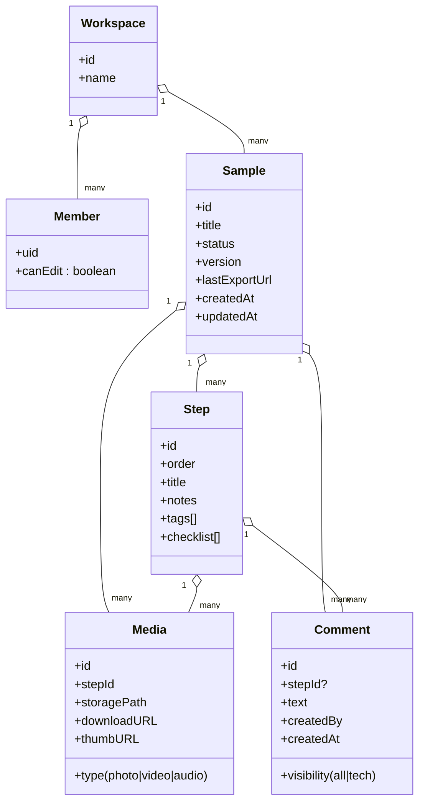
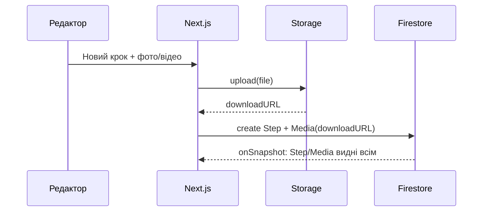
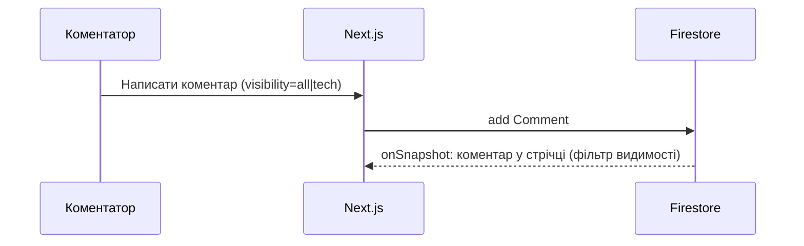

# TechStyle SeamPilot — Технічне завдання (README)

> **Мета:** створити надлегкий веб‑застосунок для **цифрових робочих інструкцій** під час відшиву зразка: фіксація кроків (фото/відео/аудіо/текст), коментарі, охайний PDF і мінімальна ролева модель.  
> **Хакатон:** TechStyle Hackathon — Ideathon (вересень 2025).

---

## 1. Проблема та рішення

### 1.1. Проблема
- Перший зразок відшивають за **паперовою інструкцією** (техпакет), яка часто неповна та неоновлювана.
- «Племінні знання»: після затвердження решта звертаються до **першої швачки**, а не до документа.
- Комунікація ітеративна й хаотична (фото/відео летять у месенджерах, губляться в історії).

### 1.2. Рішення
- Один простий веб‑інструмент, де **кроки відшиву** фіксуються під час роботи: фото/відео/аудіо + короткі нотатки та чек‑пункти.
- **Коментарі** (з медіа) з видимістю «для всіх» або «лише технічному цеху».
- **Експорт у PDF** (print‑view) для тих, кому зручний папір.
- **Мінімум ролей:** технічний цех редагує, швачки коментують.

---

## 2. Цільова аудиторія
- Експериментальні цехи / технологи (редактори).
- Швачки/оператори (коментатори).
- Керівники змін / інші зацікавлені — читачі PDF.

---

## 3. Аналоги та відмінності
- **PLM/ERP** (Centric PLM, ApparelMagic тощо): комплексні, дорогі, з довгим впровадженням.
- **Digital Work Instructions**‑платформи (Tulip, Dozuki, VKS, SwipeGuide): промислові рішення.
- **Відмінність SeamPilot:** вузьке швейне призначення, простота, миттєва користь, можливість друку.

---

## 4. Скоуп MVP (2 дні)

### 4.1. Обов’язково
- Логін (Email link / пароль) через Firebase Auth.
- Список зразків, створення зразка (лише Редактор).
- Дошка зразка: кроки (створення/редагування/сортування — лише Редактор).
- Додавання медіа до кроку (фото/відео/аудіо) в Firebase Storage.
- Коментарі з видимістю: **all | tech** (залишати можуть усі).
- Print‑view `/print/:id` → «Зберегти як PDF».

### 4.2. Бажано
- Чек‑лист у кроці (галочки).
- Теги кроків (пошук).
- QR‑код у PDF (веде на онлайн‑крок).

### 4.3. Не входить у MVP (але в роадмапі)
- Автотранскрипція аудіо/відео.
- Серверна генерація PDF (Playwright).
- Інтеграції з PLM/ERP, SSO.

---

## 5. Ролева модель (спрощена)

- **Редактор** (технічний цех): створює/редагує зразки та кроки, сортує, робить ревізії, експортує PDF, керує ролями.
- **Коментатор** (швачка/виробництво): не редагує кроки, **лише коментує** (текст/фото/відео/аудіо), обирає видимість «all/tech».

> За замовчуванням інвайт додає **Коментатора**. Перемикач ролі — в налаштуваннях workspace.

---

## 6. User‑flow (узагальнено)

1) Редактор створює зразок → додає перші кроки/або порожній.  
2) Коментатор відкриває зразок → додає коментарі (фото/відео/аудіо), за потреби приватні «лише tech».  
3) Редактор переглядає коментарі → уточнює/редагує кроки → позначає вирішене.  
4) Редактор формує ревізію → відкриває `/print/:id` → зберігає PDF і посилання в зразку.  
5) Статус зразка: `draft → open-for-comments → approved → closed`.

---

## 7. Нефункціональні вимоги

- **Простота UI:** ≤3 кліки до додавання коментаря/кроку.
- **Швидкість:** перегляд і створення кроку < 1 cек запізнення (95‑й перцентиль, realtime).
- **Надійність:** відновлення після обриву мережі; локальна черга (IndexedDB).
- **Безпека:** Firebase Auth + Firestore/Storage rules + App Check; приватні коментарі не видно коментаторам.
- **Доступність:** клавіатурна навігація, контраст, alt‑описи для зображень у print‑view.
- **Мова:** мін. укр/англ (i18n).

---

## 8. Архітектура

### 8.1. Технологічний стек
- **Next.js 14 (App Router), TypeScript, Tailwind, shadcn/ui**
- **Firebase**: Auth, Firestore, Storage (realtime через `onSnapshot`)
- **react‑firebase‑hooks**, **react‑hook‑form** + **zod**, **@dnd-kit/core**, **qrcode.react**
- **Print‑view** через браузерний «Зберегти як PDF».

### 8.2. Високорівнева діаграма
```mermaid
flowchart LR
  U[User (Редактор/Коментатор)] -->|HTTPS| UI[Next.js PWA]
  UI -->|Auth| FA[Firebase Auth]
  UI <-->|Realtime| FS[Firestore]
  UI -->|Upload| ST[Firebase Storage]
  ST --> TH[(Thumbnails - optional Cloud Function)]
  UI --> PR[Print View / PDF]
```

### 8.3. Дані (Firestore, ієрархія)


**Шляхи колекцій (приклад):**
```
workspaces/{wsId}
workspaces/{wsId}/members/{uid}
workspaces/{wsId}/samples/{sampleId}
workspaces/{wsId}/samples/{sampleId}/steps/{stepId}
workspaces/{wsId}/samples/{sampleId}/media/{mediaId}
workspaces/{wsId}/samples/{sampleId}/comments/{commentId}
```

### 8.4. Послідовності (sequence)
#### Додавання кроку з медіа


#### Коментар коментатора


#### Експорт у PDF
```mermaid
sequenceDiagram
  participant R as Редактор
  participant UI as Next.js
  R->>UI: Відкрити /print/:id
  UI-->>R: Рендер A4 макета
  R->>UI: "Зберегти як PDF"
  Note right of R: Лінк на файл зберігається
в полі lastExportUrl (ручне додавання)
```

---

## 9. API/SDK контракти (на рівні фронту)

### 9.1. TypeScript‑типи
```ts
type Role = "editor" | "commenter";

type Workspace = {
  id: string;
  name: string;
};

type Member = {
  uid: string;
  canEdit: boolean; // true = editor
};

type SampleStatus = "draft" | "open-for-comments" | "approved" | "closed";

type Sample = {
  id: string;
  workspaceId: string;
  title: string;
  status: SampleStatus;
  version: number;
  lastExportUrl?: string;
  createdAt: number;
  updatedAt: number;
};

type Step = {
  id: string;
  sampleId: string;
  order: number;
  title: string;
  notes?: string;
  tags?: string[];
  checklist?: { label: string; done: boolean }[];
};

type MediaType = "photo" | "video" | "audio";

type Media = {
  id: string;
  sampleId: string;
  stepId: string;
  type: MediaType;
  storagePath: string;
  downloadURL: string;
  thumbURL?: string;
  createdAt: number;
};

type CommentVisibility = "all" | "tech";

type Comment = {
  id: string;
  sampleId: string;
  stepId?: string;
  text?: string;
  media?: Media[]; // опціонально вкладати ID/URL
  visibility: CommentVisibility;
  createdBy: string;
  createdAt: number;
};
```

### 9.2. Ключові хелпери (приклад інтерфейсу)
```ts
createSample(wsId: string, title: string): Promise<Sample>
createStep(sampleId: string, data: Partial<Step>): Promise<Step>
reorderSteps(sampleId: string, orders: {id: string; order: number}[]): Promise<void>
uploadMedia(file: File, path: string): Promise<{downloadURL: string, storagePath: string}>
addComment(sampleId: string, data: Omit<Comment, "id"|"createdAt">): Promise<Comment>
setMemberRole(wsId: string, uid: string, canEdit: boolean): Promise<void>
```

---

## 10. Права доступу (Firestore/Storage rules — мінімум)

> **Ідея:** тільки редактори змінюють зразки/кроки; коментувати можуть усі; приватні коментарі бачать лише редактори.

```js
rules_version = '2';
service cloud.firestore {
  match /databases/{database}/documents {

    function isAuth() { return request.auth != null; }
    function isEditor(wsId) {
      return get(/databases/$(database)/documents/workspaces/$(wsId)/members/$(request.auth.uid)).data.canEdit == true;
    }

    match /workspaces/{wsId} {
      allow read: if isAuth();
      allow write: if isEditor(wsId);

      match /members/{uid} {
        allow read: if isAuth();
        allow write: if isEditor(wsId);
      }

      match /samples/{sid} {
        allow read: if isAuth();
        allow create, update, delete: if isEditor(wsId);

        match /steps/{stepId} {
          allow read: if isAuth();
          allow write: if isEditor(wsId);
        }

        match /comments/{cid} {
          allow read: if isAuth() && (
            resource.data.visibility == "all" || isEditor(wsId)
          );
          allow create: if isAuth(); // коментувати можуть усі
          allow update, delete: if isEditor(wsId) ||
             (request.resource.data.createdBy == request.auth.uid);
        }

        match /media/{mid} {
          allow read: if isAuth();
          allow create, update, delete: if isEditor(wsId);
        }
      }
    }
  }
}
```

**Storage (есенція):**
```js
rules_version = '2';
service firebase.storage {
  match /b/{bucket}/o {
    match /{allPaths=**} {
      allow read, write: if request.auth != null; // звужуйте шляхами /workspaces/{wsId}/...
    }
  }
}
```

---

## 11. UI‑каркас (сторінки та ключові компоненти)

- `/login` — вхід (email‑link/пароль).
- `/samples` — список зразків + «Створити зразок» (лише Редактор).
- `/s/:id` — дошка зразка:  
  - **StepList** (drag&drop, тільки Редактор)  
  - **StepDetail** (прев’ю медіа, нотатки, чек‑лист)  
  - **CommentsPane** (фільтр: all/tech)  
  - **CaptureBar**: Фото / Відео / Аудіо / Текст / Експорт / Ревізія (Редактор)
- `/print/:id` — друк/збереження PDF.

**Компоненти:** `CaptureBar`, `MediaUploader`, `StepList`, `StepItem`, `StepDetail`, `CommentItem`, `RoleBadge`, `VisibilityToggle`, `PrintHeader`.

---

## 12. i18n, доступність, офлайн

- **i18n:** JSON словники (`/locales/uk.json`, `/locales/en.json`).  
- **a11y:** ролі/лейбли кнопок, alt‑описи, видимий фокус, достатній контраст.  
- **Офлайн:** IndexedDB для черги кроків/медіа; повтор аплоаду після відновлення мережі.

---

## 13. Аналітика та логування
- Події: створення зразка/кроку, завантаження медіа, експорт PDF, зміна ролі.
- Помилки UI → Sentry (опц.), функції → Cloud Logging.
- Мінімальна метрика: середній час від створення кроку до коментаря техцеху.

---

## 14. Роадмап після MVP
- Серверна генерація PDF (Playwright) + збереження в Storage.
- Модуль POM/типи швів/лапки з довідником.
- Автотранскрипція аудіо й пошук по ній.
- Імпорт лекал/зв’язки з CAD/PLM.
- Мобільний режим з камерою by default, скан QR прямо в застосунку.

---

## 15. Встановлення та запуск

```bash
# 1) Клонувати ваш чистий репозиторій
git clone https://github.com/YOUR_NAME/techstyle-seampilot.git
cd techstyle-seampilot

# 2) Встановити залежності
pnpm i   # або npm i / yarn

# 3) Створити .env.local з Firebase ключами
# NEXT_PUBLIC_FIREBASE_API_KEY=...
# NEXT_PUBLIC_FIREBASE_AUTH_DOMAIN=...
# NEXT_PUBLIC_FIREBASE_PROJECT_ID=...
# NEXT_PUBLIC_FIREBASE_STORAGE_BUCKET=...
# NEXT_PUBLIC_FIREBASE_APP_ID=...
# NEXT_PUBLIC_FIREBASE_MEASUREMENT_ID=... (опц.)

# 4) Запустити дев-сервер
pnpm dev  # http://localhost:3000
```

---

## 16. Діаграми (перелік для README, якщо треба доробити окремо)
- Архітектурна діаграма (клієнт → Firebase → Storage → Print).  
- ER‑діаграма моделі даних (Workspace/Members/Sample/Step/Media/Comment).  
- Sequence: «Додати крок із медіа».  
- Sequence: «Коментар з видимістю tech».  
- Sequence: «Експорт у PDF».

---

## 17. Ліцензія
Рекомендовано **MIT** для хакатону (простий дозвіл на використання/форк).

---

### Короткий опис для репозиторію
> **SeamPilot** — MVP для TechStyle: цифрові робочі інструкції під час відшиву зразка. Фото/відео/аудіо кроки, коментарі (для всіх або тільки техцеху) та охайний PDF у два кліки.
