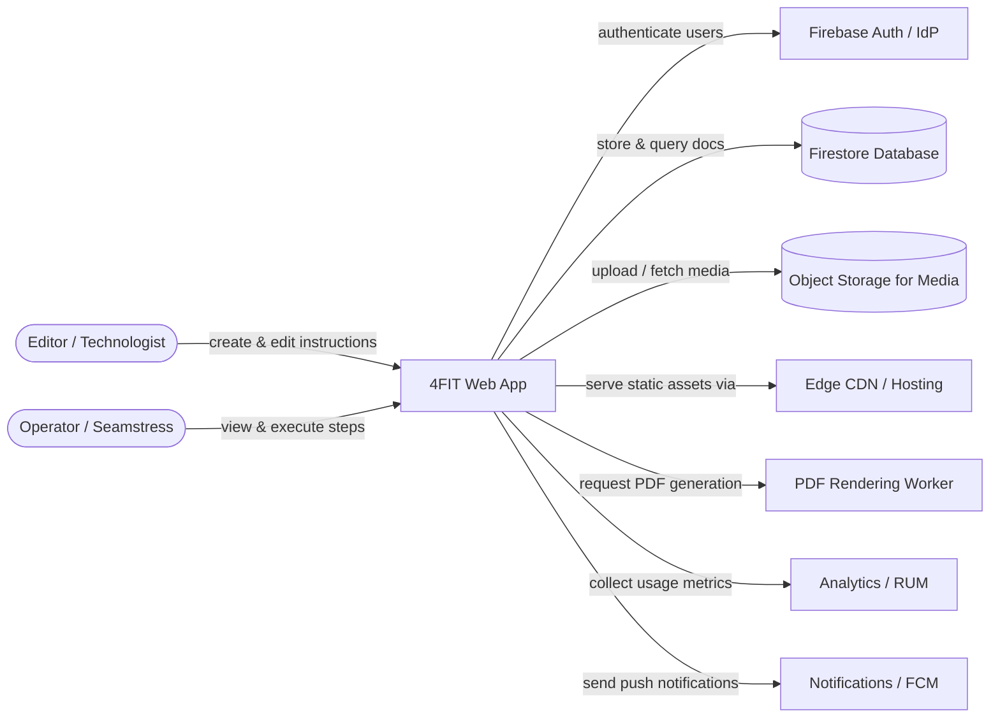

# TechStyle SeamPilot — Технічне завдання (README)

> **Мета:** створити веб‑застосунок для **цифрових робочих інструкцій** під час відшиву зразка: фіксація кроків (фото/відео/аудіо/текст), коментарі, охайний PDF і мінімальний MVP.  
> **Хакатон:** TechStyle Hackathon — Ideathon (вересень 2025).

---

## 1. Проблема та рішення

### 1.1. Проблема
- перший зразок відшивають за **паперовою інструкцією** (техпакет), яка часто неповна та неоновлювана;
- «племінні знання»: після затвердження решта звертаються до **першої швачки**, а не до документа;
- комунікація ітеративна й хаотична (фото/відео летять у месенджерах, губляться в історії).

### 1.2. Рішення
- один простий веб‑інструмент, де **кроки відшиву** фіксуються під час роботи: фото/відео/аудіо + короткі нотатки у вигляді тексту.
- **коментарі** (з медіа) з видимістю «для всіх» або «лише технічному цеху»;
- **експорт у PDF** (print‑view) для тих, кому зручний папір;
- **мінімум ролей:** технічний цех редагує, швеї коментують.

---

## 2. Цільова аудиторія
- експериментальні цехи / технологи (редактори);
- спеціалісти виробництва / оператори швейного обладнання (коментатори).

---

## 3. Аналоги та відмінності
- **PLM/ERP** (Centric PLM, ApparelMagic тощо): комплексні, дорогі, з довгим впровадженням;
- **Digital Work Instructions**‑платформи (Tulip, Dozuki, VKS, SwipeGuide): промислові рішення;
- **відмінність 4FIT:** вузьке швейне призначення, простота, миттєва користь, можливість друку.

---

## 4. C4 Level 1: System Context

---

